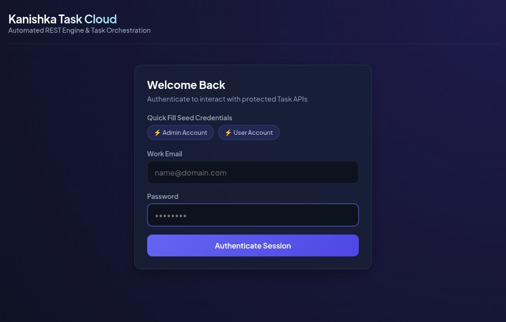
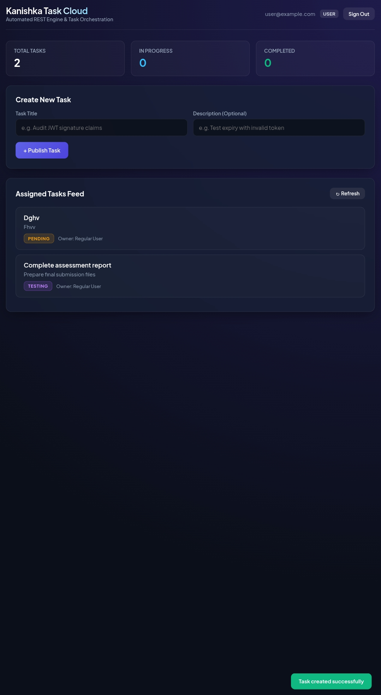

<div align="center">

# 📋 Kanishka Task Management System

### Secure REST APIs | Task Management | Role-Based Access Control


**Developed for the Node.js Developer Intern Assessment**  
**Kanishka Software Pvt. Ltd.**

</div>

---

## 📌 About the Project

The Kanishka Task Management System is a backend application built to manage tasks through RESTful APIs. It focuses on authentication, task management, database integration, and role-based access control.

## ✨ Features

- User registration and login
- JWT-based authentication
- Password hashing with bcrypt
- Create, view, and edit tasks
- User and administrator roles
- Task ownership and access control
- Task status management
- Database migrations and seeders
- API testing with Postman
## 🔑 Demo Login Credentials

Use the following demo accounts to test the application.

| Role | Email | Password | Permissions |
|---|---|---|---|
| Administrator | admin@example.com | `AdminPass123!` | System-wide visibility and status transitions |
| Regular User | user@example.com | `UserPass123!` | Task access based on assigned user permissions |

**Note:** These credentials should only be used for local testing or a demo environment. Confirm that both accounts exist in the configured database before using them. Do not use these passwords in production.
*Features listed above should match the actual implementation.*
## 📸 Application Screenshots

### Authentication Portal


### Task Management Dashboard


## 🛠️ Technology Stack

| Technology | Purpose |
|---|---|
| Node.js | Backend runtime |
| Express.js | REST API framework |
| MySQL | Relational database |
| Knex.js | Database queries and migrations |
| JWT | Authentication |
| bcrypt | Password hashing |
| Postman | API testing |

## 📁 Project Structure

```text
kanishka-task-management/
├── migrations/
├── seeds/
├── postman/
├── public/
├── src/
├── tests/
├── .env.example
├── package.json
└── README.md
```

## ⚙️ Installation and Setup

### 1. Clone the repository

```bash
git clone <your-repository-url>
cd kanishka-task-management
```

### 2. Install dependencies

```bash
npm install
```

### 3. Configure environment variables

Create a `.env` file using `.env.example` and configure the required database credentials and JWT secret.

### 4. Set up the database

Create the required MySQL database and run the migration and seed commands configured in `package.json`.

### 5. Start the application

Use the start script defined in `package.json`.

## 🔄 Task Statuses

- Pending
- In Progress
- Testing
- Completed

## 🧪 API Testing

Use the Postman collection in the `postman/` directory, if provided, to test the implemented endpoints.

## 🔐 Security

The application is designed to use secure authentication, password hashing, and role-based access controls. Verify these protections against the actual implementation.

## 👩‍💻 Author

**Akshada Valkunde**

Developed as part of the Kanishka Software Pvt. Ltd. Internship Assessment.

</EOF>
